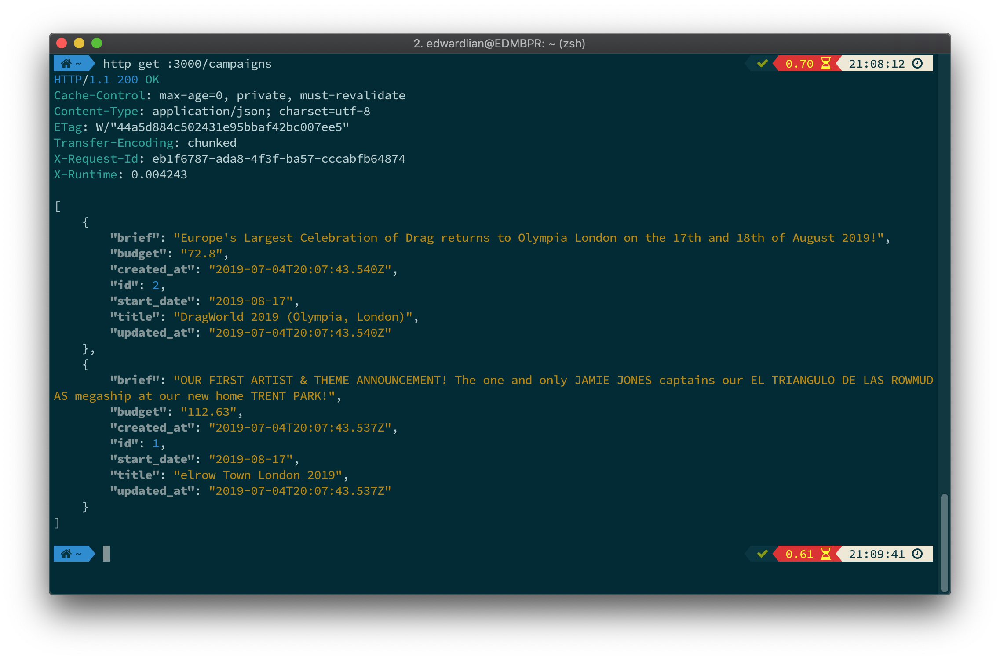
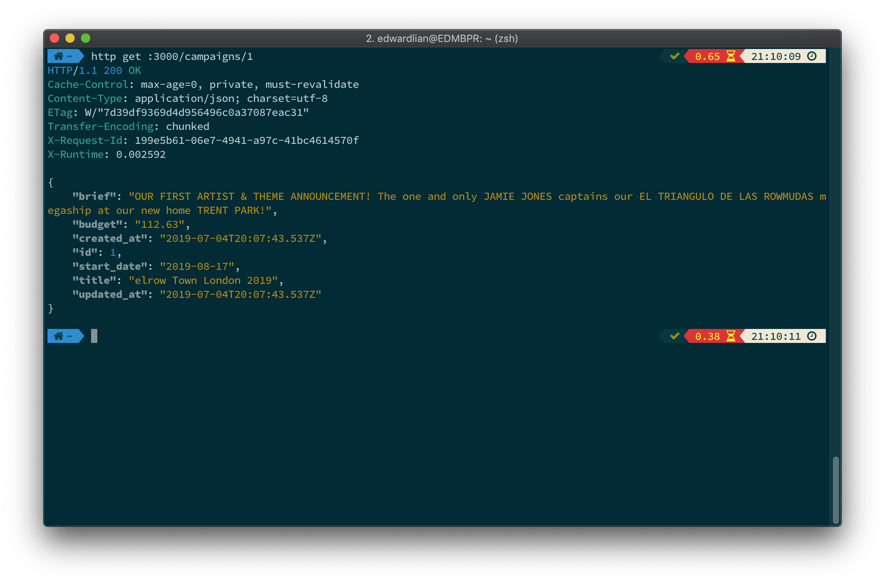
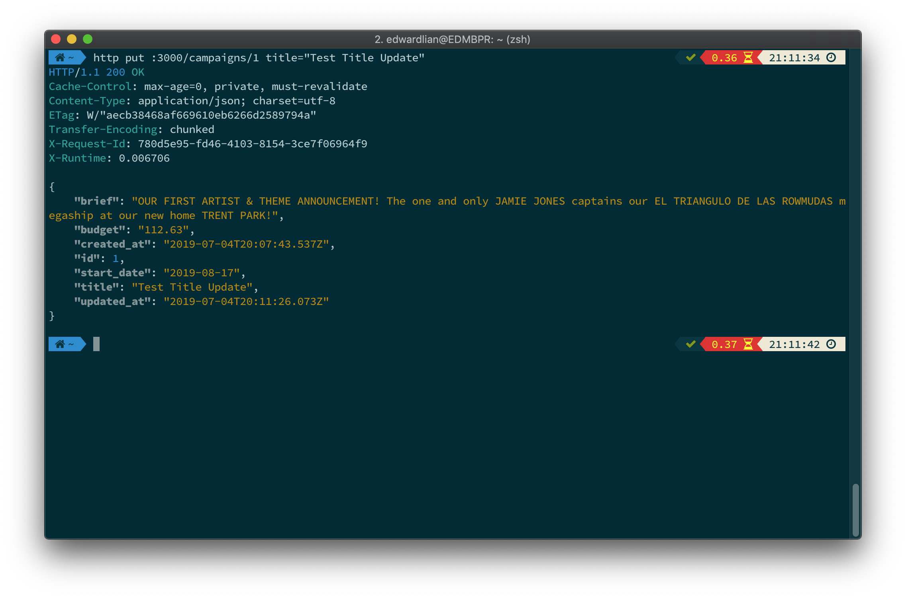
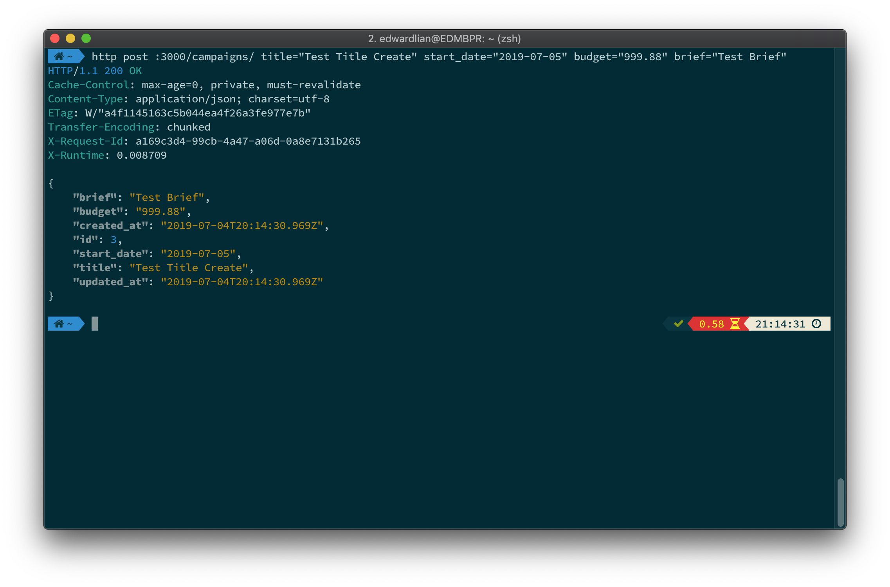
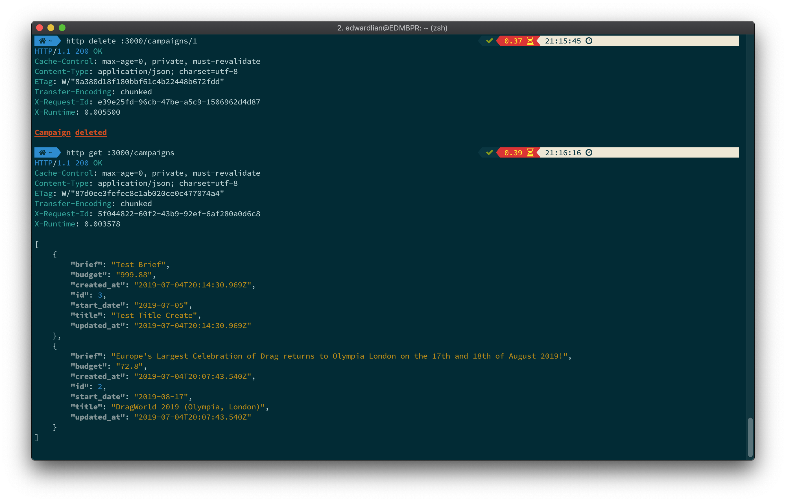
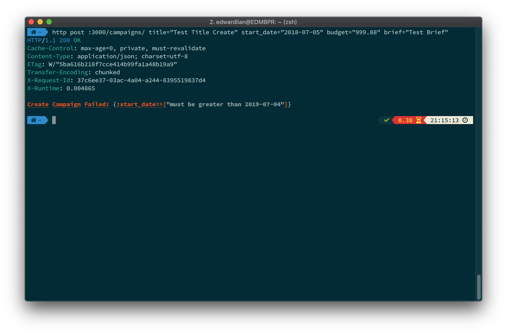
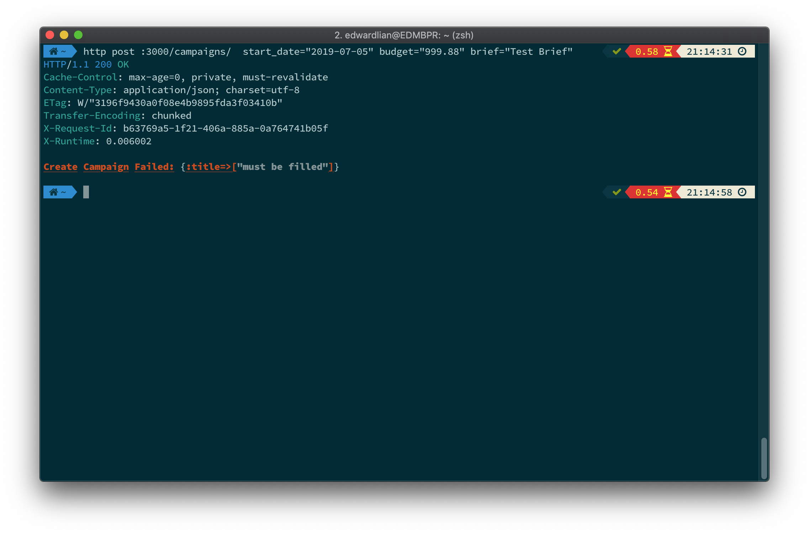
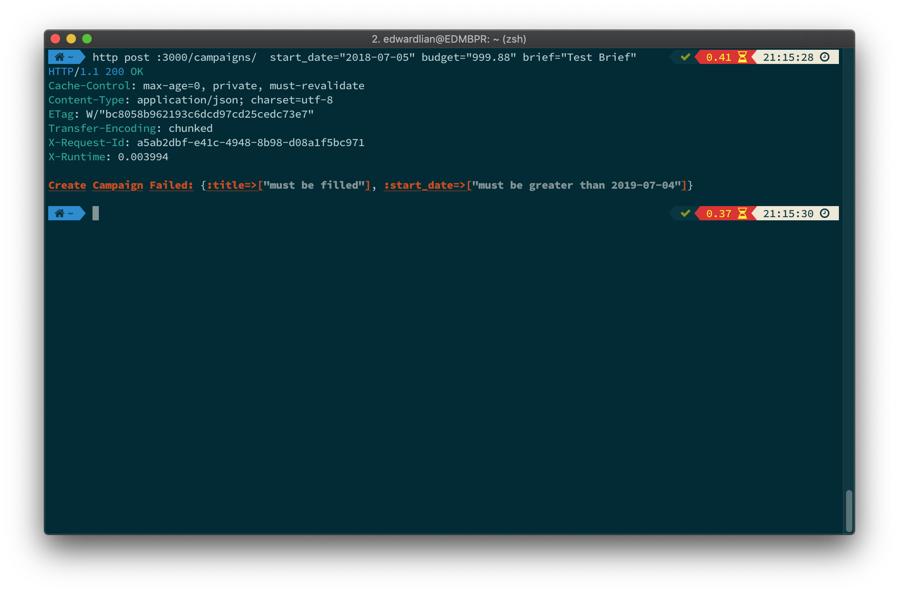

# Fanbytes Test Task
## Trailblazer (Campaign)

> The test task is as follows:
> Use the trailblazer methodology to create a Rails API with one Restful endpoint (/campaigns). The CRUD functionality should function completely.
> You can see the trailblazer docs here: http://trailblazer.to/
> 
> A campaign can have the following parameters:
> * Title
> * Start Date
> * Budget
> * Brief
> 
> There should be some validation on the start date to ensure it is in the future.

### Environment:
* Ruby version: 2.6.3
* Rails version: 5.2.3

### Concepts Structure:
```bash
app
├── concepts
│   └── campaign
│       ├── contract
│       │   ├── create.rb
│       │   └── update.rb
│       └── operation
│           ├── create.rb
│           ├── delete.rb
│           ├── index.rb
│           ├── show.rb
│           └── update.rb
├── controllers
│   ├── application_controller.rb
│   ├── campaigns_controller.rb
│   └── concerns
```

### Model:
```ruby
create_table "campaigns", force: :cascade do |t|
  t.string "title"
  t.date "start_date"
  t.decimal "budget"
  t.text "brief"
  t.datetime "created_at", null: false
  t.datetime "updated_at", null: false
end
```

### Test Case:
1. Index
  
2. Show
  
3. Update
  
4. Create
  
5. Destroy
  
6. Create Error (start_date)
  
7. Create Error (title)
  
8. Create Error (start_date & title)
  


